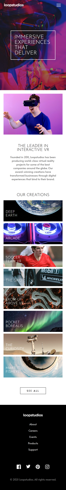

# Frontend Mentor - Loopstudios landing page solution

This is a solution to the [Loopstudios landing page challenge on Frontend Mentor](https://www.frontendmentor.io/challenges/loopstudios-landing-page-N88J5Onjw). Frontend Mentor challenges help you improve your coding skills by building realistic projects.

## Table of contents

- [The challenge](#the-challenge)
- [Screenshot](#screenshot)
- [Links](#links)
  - [Built with](#built-with)
  - [What I learned](#what-i-learned)
  - [Continued development](#continued-development)
  - [Useful resources](#useful-resources)

### The challenge

Users should be able to:

- View the optimal layout for the site depending on their device's screen size
- See hover states for all interactive elements on the page

### Screenshot

### Links

- Solution URL: [Solution](https://github.com/remainhumble/-Loopstudios-landing-page)
- Live Site URL: [Live Site](https://remainhumble.github.io/-Loopstudios-landing-page/)

### Built with

- Semantic HTML5 markup
- CSS custom properties
- Flexbox
- CSS Grid
- Mobile-first workflow
- Sass

### What I learned

Viewing the optimal layout depending on their device's screen size. Using Sass to save time while styling the web page.

### Continued development

I wish to be familiar with the use of CSS Preprocessors. I had to admit I am extremely unfamiliar with them and I do realize the first step is ALWAYS the hardest.

### Useful resources

- [CSS Layout Generator](https://layout.bradwoods.io/customize) - This helped me with grids.
- [Sass](https://sass-lang.com/documentation/) - Sass is a stylesheet language that’s compiled to CSS. It allows me to use variables, nested rules, mixins, functions, and more, all with a fully CSS-compatible syntax. Sass helps keep large stylesheets well-organized and makes it easy to share design within and across projects.
